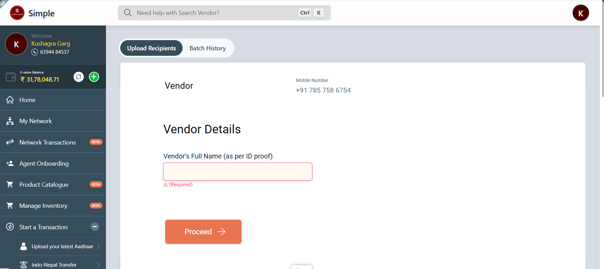
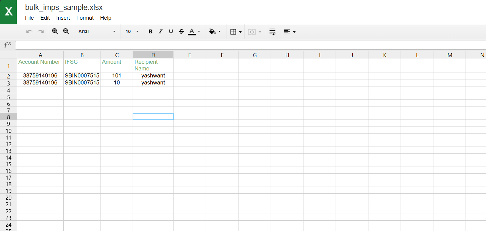
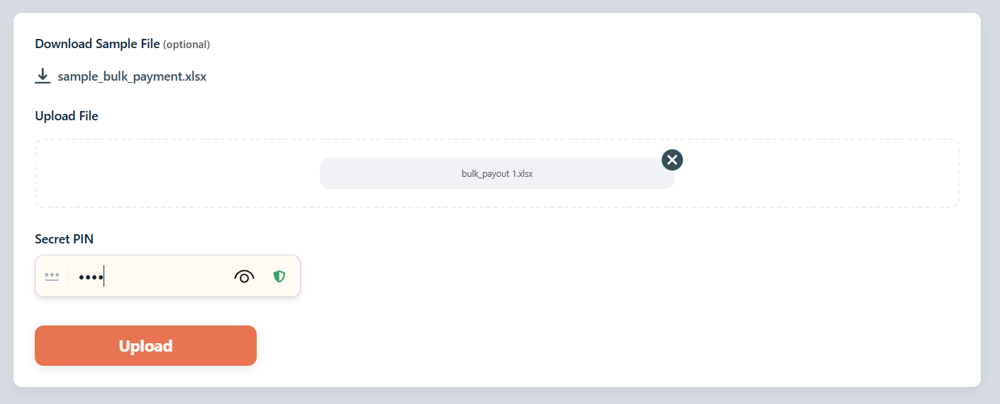
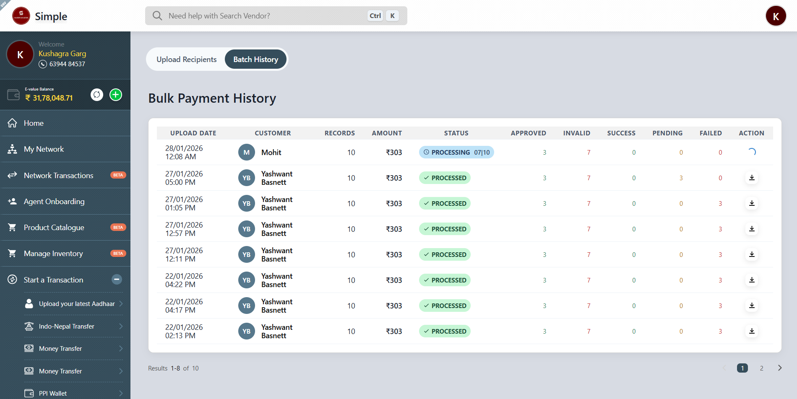
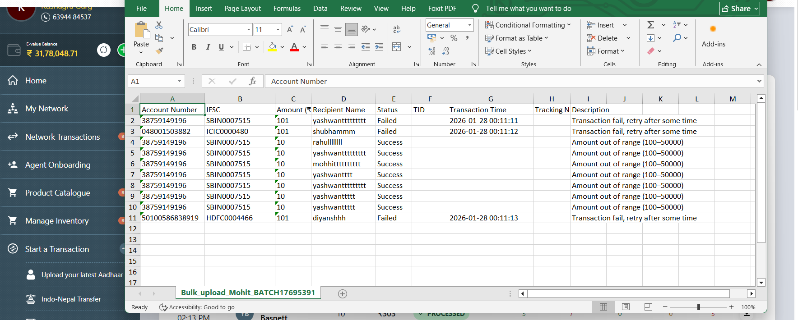

## What is Bulk IMPS?

Bulk IMPS (Immediate Payment Service) is a feature that allows retailers to process multiple money transfers simultaneously for customers. Instead of processing individual transactions one by one, retailers can upload a file containing multiple recipient details and execute all transfers in a single batch.

## How to do Bulk IMPS transactions?

### Step 1: Search for the customer

- Navigate to the Bulk IMPS section from the main menu.
- Enter the customer's mobile number in the "Mobile Number" field (with +91 country code).
- Click the **Proceed** button to move to the next screen.

### Step 2: Enter customer details

- On the "Customer Details" screen, the customer's mobile number will be displayed at the top.
- In the "Customer's Full Name (as per ID proof)" field, enter the customer's name exactly as it appears on their ID proof.
- Click the **Proceed** button to continue.

### Step 3: Verify customer with OTP

- The system will display the customer's name and mobile number.
- In the "Verify Customer" section, click the **OTP** button to send an OTP to the customer's mobile number.
- The customer will receive the OTP on their registered mobile number.
- Ask the customer for the OTP and enter it in the "OTP" field.
- A countdown timer will show when you can resend the OTP (e.g., "Resend OTP in 00:22").
- Click the **Proceed** button to verify and continue.

### Step 4: Create the recipients file

After customer verification, you will need to create an Excel file containing the recipient details.

#### File structure

The Excel file must contain exactly 4 columns in the following order:

1. **Account Number** - Recipient's bank account number
2. **IFSC Code** - Bank IFSC code
3. **Amount** - Transfer amount in rupees
4. **Name** - Recipient's full name

#### Important conditions for file creation

##### Amount validation

- Transaction will fail 100% if the amount is between ₹0-₹100.
- The amount must be **more than ₹100** for the transaction to succeed.

#### How to create the file

- Ask the customer to provide all recipient details (account numbers, IFSC codes, amounts, and names).
- Create an Excel file (.xlsx format) with the 4 required columns.
- Enter all recipient information provided by the customer.
- Save the file on your computer.
- A sample file is available for reference in the system.

### Step 5: Upload the recipients file

- On the same screen, scroll down to find the file upload section.
- Click the purple **Select File** button, or drag and drop the Excel file into the designated area.
- In the "Secret PIN" field, enter your retailer Secret PIN for authentication.
- Click the **Upload** button to submit the file.

### Step 6: Monitor batch processing status

- After uploading, navigate to the **Batch History** tab.
- The uploaded batch will appear in the "Bulk Payment History" table.
- The status will show as **PROCESSING** (e.g., "PROCESSING 07/10" means 7 out of 10 records are being processed).
- The file will remain in PROCESSING status until all transactions are completed.
- Once processed, the status will change to **PROCESSED** with a green checkmark.

### Step 7: Download and check transaction results

- In the Batch History screen, locate the batch you want to review.
- Click the download button (↓) in the "ACTION" column adjacent to the uploaded batch.
- The result file will download in Excel format with the name: "Bulk_upload_[CustomerName]_BATCH[BatchNumber].xlsx"

#### Understanding the result file

The downloaded file contains the following columns:

| Field Name | Description |
|------------|-------------|
| Account Number | Recipient's bank account number |
| IFSC | Bank IFSC code |
| Amount (₹) | Transfer amount |
| Recipient Name | Full name of the recipient |
| Status | Shows "Success" or "Failed" for each transaction |
| TID | Transaction ID for tracking |
| Transaction Time | Timestamp of when the transaction was processed |
| Tracking Number | Unique tracking number for the transfer |
| Description | Detailed reason for transaction success or failure |

- Review the **Status** column to see which transactions succeeded or failed.
- Check the **Description** column for specific reasons why transactions failed (e.g., "fund.transfer.failed", "Amount out of range (100-5000)").
- Use the **TID** and **Tracking Number** for customer reference and tracking purposes.

## Key Points

- Always verify the customer's mobile number and name before proceeding.
- All transfer amounts must be more than ₹100 and less than ₹50000.
- Use the correct file format with exactly 4 columns: Account Number, IFSC Code, Amount, and Name.
- Enter your Secret PIN carefully when uploading the file.
- Monitor the batch processing status in the Batch History tab.
- Download the result file to check individual transaction statuses and reasons for any failures.
- Keep the result file for customer reference and record-keeping purposes.
- The customer's OTP is valid for a limited time - complete the verification promptly.